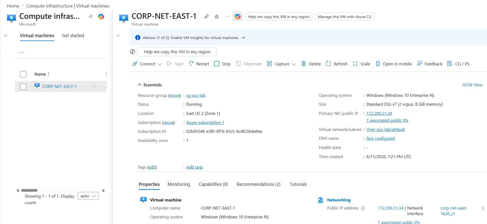

# Azure Sentinel SIEM Home Lab – Honeypot & Attack Map

## Overview
Deployed a Windows 10 honeypot VM in Azure, forwarded security logs to Microsoft Sentinel, and built a live attack map to visualize real-world brute-force attacks by geolocation.

**Tools used:** Microsoft Azure, Microsoft Sentinel, Log Analytics Workspace, KQL, Windows 10

---

## Architecture

Real-world attackers on the public internet hit the honeypot VM through an intentionally open NSG (Network Security Group). The VM forwards its security logs to a Log Analytics Workspace, which feeds into Microsoft Sentinel (the SIEM). Sentinel then powers the live attack map showing where attacks are coming from globally.

---

## Step 1 – Deployed the Honeypot VM

Deployed a Windows 10 VM in Azure configured as a honeypot. Set the Network Security Group to allow all inbound traffic to expose it to the internet and attract real attackers.

## Step 2 – Observed Failed Login Attempts in Event Viewer

RDP'd into the honeypot VM and opened Event Viewer. Found 36,000+ Event ID 4625 audit failures — real attackers trying to brute-force their way in using common usernames like ADMIN, REMOTE, and TEST.

## Step 3 – Queried Failed Logins with KQL

Forwarded security logs to a Log Analytics Workspace and used KQL to query Event ID 4625. Results show the attacker IP address, account names used, and timestamps of every failed login attempt.

## Step 4 – Connected Microsoft Sentinel as the SIEM

Connected Microsoft Sentinel and configured the Windows Security Events via AMA data connector. The dashboard shows 195K security events collected and logs being received in real time.

## Step 5 – Enriched Logs with Geolocation Data

Imported a 54,000-row IP geolocation watchlist into Sentinel. Used an ipv4_lookup KQL query to enrich the raw logs with city, country, latitude, and longitude — showing exactly where attacks are coming from.

## Step 6 – Built the Live Attack Map

Built a custom Sentinel Workbook to visualize attack data on a live world map. The largest clusters came from Czechia (32.6K) and the Netherlands (23.2K), with additional hits from the Philippines, India, South Korea, and the United States.
